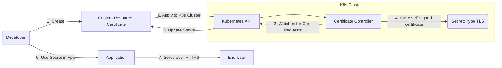
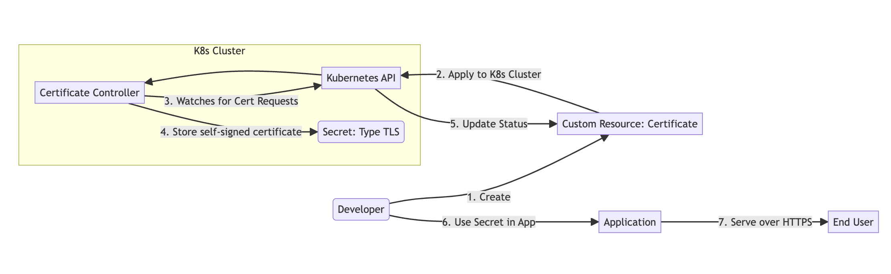

## Architecture

The diagram below shows the architecture and flow of certificate management
within a Kubernetes cluster.

  
Mermaid Graph

1. The developer creates a custom resource (CR) that defines a `Certificate`
   according to its [canonical definition](#canonical-definition-of-a-certificate).
2. The custom certificate resource is applied to the Kubernetes cluster via
   Kubernetes API.
3. The certificate manager is responsible for watching certificate requests that
   come through the Kubernetes API. Upon detecting a Certificate request, the
   controller will generate a self-signed TLS certificate.
4. The controller then stores the generated certificate in a Kubernetes Secret
   (type `TLS`) resource as specified in the `secretRef`.
5. The Kubernetes API updates the status of the Certificate resource,
   providing feedback on the process.
6. The developer uses the created Secret containing the TLS certificate in their
   application deployment.
7. The application serves traffic over HTTPS using the TLS certificate to ensure
   secure communication with end-users.

## Canonical Definition of a Certificate

A `Certifiate` is defined using a Kubernetes manifest which contains the following fields:

| Field                 | Description                                                          | Value             |
| --------------------- | -------------------------------------------------------------------- | ----------------- |
| `apiVersion`          | The operator version that takes care of managing certificates        | `certs.k8c.io/v1` |
| `kind`                | The certificate resource kind                                        | `Certificate`     |
| `metadata.name`       | Name of the certificate                                              |                   |
| `spec.organization`   | Name of the organization.                                            |                   |
| `spec.dnsName`        | The DNS name for which the certificate should be issued.             |                   |
| `spec.validForDays`   | (Optional) The number of days until the certificate expires.         | Default 365       |
| `spec.altNames`       | (Optional) Subject alternate names, other than DNSName.              |                   |
| `spec.secretRef`      | A reference to the Secret object in which the certificate is stored. |                   |
| `spec.secretRef.name` | Name of the referenced Secret object.                                |                   |

The `status` section of the `Certificate` CR:

| Field          | Description                                                      |
| -------------- | ---------------------------------------------------------------- |
| `status.state` | State of the Certificate. Possible values are `Valid`, `Expired` |
